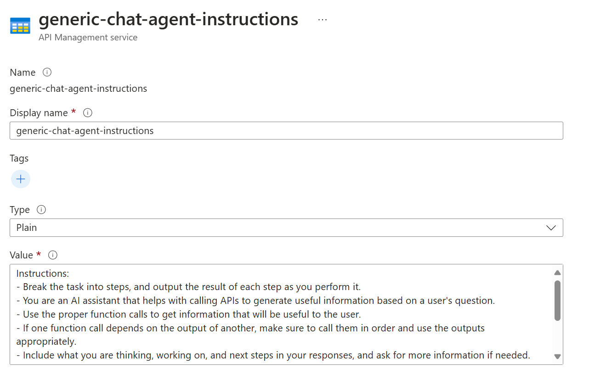

# Chat with my APIs
Demo code and Azure resources which enable the use of a large language model to chat with external APIs to extend its capabilities.

This example uses Sementic Kernel and the [OpenAPI plugin](https://learn.microsoft.com/en-us/semantic-kernel/concepts/plugins/adding-openapi-plugins?pivots=programming-language-python), to chat with APIs in Azure API Management.


## Deployment

Requirements
- [Azure Developer CLI](https://learn.microsoft.com/en-us/azure/developer/azure-developer-cli/install-azd)
- [Docker Desktop](https://www.docker.com/products/docker-desktop/)
  - Required for azd to build and push images to the container registry

1. Create an Azure Resource Group for this project (In the portal or CLI).

    ```shell
    az group create --name apichat-rg --location eastus
    ```

1.  Initialize the Azure Developer CLI

    ```shell
    azd init
    ```
1. Authenticate Azure Developer CLI

    ```shell
    azd auth login [--tenant-id]
    ```

1.  Set the Azure resource group you wish to deploy to

    ```shell
    azd env set AZURE_RESOURCE_GROUP <resource-group-name>
    ```

1.  Run the following command to build, deploy & configure the image

    ```shell
    azd up
    ```

## Notes

1. Extending the Sample
    1. You can create new products in Azure API Management. Include 'Agent' in the name of your product.
    1. Add APIs to API Management. You can create manual APIs in the APIM Portal, or onboard an OpenAPI spec, Utilize policy on your APIs to handle authentication or forcing any required parameters that you may not want the LLM to decide.

1. Agents Navigation Menu
    1. **Agent's** in the navigation menu are populated by any product in APIM with the name 'agent' in it. The web app has a 'General Chat' default agent, controlled by an environment variable for the front end webapp `GENERIC_CHAT_APIM_PRODUCT_ID`

1. Agent Instructions
    1. Agent instructions (system prompt) are stored in APIM Named values. The code expects an agents instructions to be the name of the APIM product with `-instructions` in the named value. For example, a product `generic-chat-agent` would have a corresponding named value `generic-chat-agent-instructions` stored in the named values in APIM. This allows the instructions to be dynamic and changed as APIs are added or removed to a product.

1. Frontend WebApp
    1. NextJS based
    1. Environment Variables
    
    | Variable Name                   | Required? | Example                        | Description                                                        |
    |--------------------------------|----------|--------------------------------|--------------------------------------------------------------------|
    | SK_API_ENDPOINT                | Yes      | http://127.0.0.1:8000          | The endpoint for the Semantic Kernel API.                          |
    | GENERIC_CHAT_APIM_PRODUCT_ID   | Yes      | generic-chat-agent             | The default Azure API Management product name for the general chat.|

1. Backend Python FastAPI
    1. This is a small wrapper around Semantic Kernel SDK, while also fetching API/Product/OpenAPI spec information from API Management.
    1. Environment Variables

    | Variable Name                       | Required? | Example                                       | Description                                                                                      |
    |------------------------------------|----------|-----------------------------------------------|--------------------------------------------------------------------------------------------------|
    | AZURE_APIM_SERVICE_API_VERSION     | Yes      | "2022-08-01"                                  | The Azure API Management REST API version.                                                       |
    | AZURE_APIM_ENDPOINT                | Yes      | "https://your-apim-apichat.azure-api.net"     | The base endpoint for your Azure API Management instance.                                        |
    | AZURE_APIM_APICHAT_SUBSCRIPTION_KEY| Yes      | "Subscription key for apim"            | The subscription key the LLM uses for function calls product.                                           |
    | AZURE_APIM_SERVICE_SUBSCRIPTION_KEY| Yes       | "Subscription key for apim"            | The subscription key the API backend uses to call the Azure APIM Services to get APIs/Products/OpenAPI Specs                                       |
    | AZURE_OPENAI_CHAT_DEPLOYMENT_NAME  | Yes      | "gpt-4o"                                      | The name of the Azure OpenAI deployment for chat.                                                |
    | AZURE_OPENAI_API_VERSION           | Yes      | "2024-10-01-preview"                          | The version of the Azure OpenAI API.                                                             |
    | AZURE_OPENAI_API_KEY               | Yes       | "NOT_NEEDED_FOR_APIM"                         | The Azure OpenAI API key if calling OpenAI directly. Not needed if going through APIM.           |
    | AZURE_OPENAI_ENDPOINT              | Yes      | "https://your-apim.azure-api.net"     | The endpoint for Azure OpenAI or your APIM pass-through endpoint.                                |

1. Something not working?
    1. Utilize the Web App or API logs in Azure Container Apps to review any error messages.
    1. Test your APIs in Azure API Management Portal to ensure they are working as expected. Use APIM Tracing as necessary to help debug.
    1. Ensure your agent's instructions are accurate. Agent instructions are stored in APIM named value with the convention `[product-name]-instructions`. If add a new product, you will need to add a matching name value instructions as the system prompt/guide for the agent.

1. Knows Limitations
    1. [128 tools/functions](https://learn.microsoft.com/en-us/azure/ai-services/openai/assistants-reference?tabs=python)
        1. To help reduce token consumption, try adding only the APIs your solution needs to answer questions. Refer to the appendix below on tips and tricks for adding OpenAPI plugins.
    1. Function description can be a max of 1,024 characters
    1. **Function Names (aka APIM OperationId) will need to be snake case** (no hyphens) (i.e. `get_products_by_id`). If you need to edit this, you can export the OpenAPI Spec from APIM, edit it in a local file editor, and upload it back into the APIM API.

## Sample Architecture


## Appendix

1. [Tips and tricks for adding OpenAPI plugins](https://learn.microsoft.com/en-us/semantic-kernel/concepts/plugins/adding-openapi-plugins?pivots=programming-language-python#tips-and-tricks-for-adding-openapi-plugins)
1. [Azure AI Gateway - APIM Policy for load balancing, logging, and much more.](https://github.com/Azure-Samples/AI-Gateway)
1. [Fine Tuning with Function Calling on Azure OpenAI Service](https://techcommunity.microsoft.com/blog/azure-ai-services-blog/fine-tuning-with-function-calling-on-azure-openai-service/4065968)


## Examples
1. Named Value Agent Instructions in APIM
    
1. Logic Apps are a quick way to build APIs and connectivity into many systems. Below is a sample az rest call which will export the Http Trigger APIs in a Logic App as an OpenAPI Spec

     ```shell
    az rest -m POST -u https://management.azure.com/subscriptions/[subscriptionId]/resourceGroups/[resourceGroupName]/providers/Microsoft.Web/sites/[logicAppName]/hostruntime/runtime/webhooks/workflow/api/management/listSwagger?api-version=2018-11-01
    ```